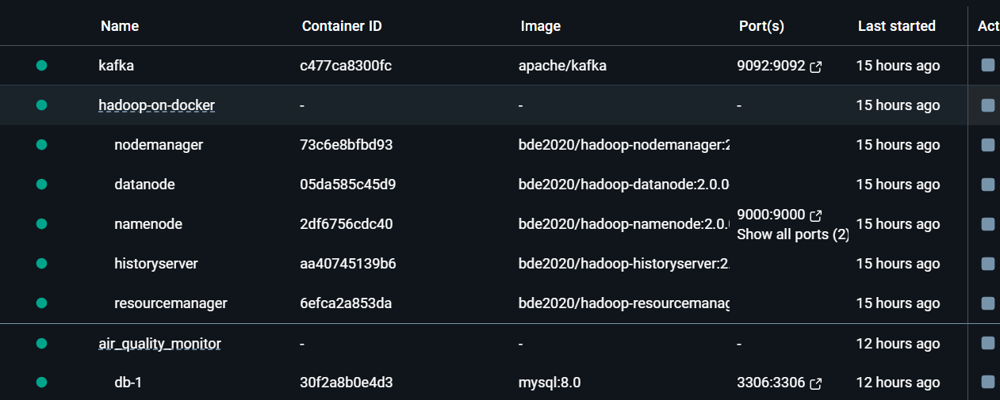

# Air Quality Monitor: Comprehensive Environmental Data Solution

### Team Contributions

```markdown
## GROUP NO : 7
------------------------------------------------
| No. | Name              | Registration Number |
|-----|-------------------|---------------------|
| 1   | NDUWAYEZU Placide | 223027936           |
| 2   | UWASE Aline       | 218009283           |
| 3   | MUREMYI Samuel    | 223026694           |
-------------------------------------------------

```

## Project Case Study
### Background and Motivation
In an era of increasing environmental concerns, real-time air quality monitoring has become crucial for public health and environmental policy. The Air Quality Monitor project aims to create a robust, scalable solution for tracking and analyzing air quality data.
### Project Objectives

1. **Real-time Data Collection**: Develop a system to continuously fetch air quality data from official sources.
2. **Data Processing Pipeline**: Create an efficient mechanism to transform raw API data into meaningful insights.
3. **Distributed Storage**: Implement a scalable storage solution using HDFS and cloud databases.
4. **Data Visualization**: Build an interactive dashboard for accessible environmental insights.

## Project Architecture
### Technical Architecture

- **Data Ingestion**: Retrieve data from ACT Government Air Quality API
- **Stream Processing**: Apache Kafka for real-time data streaming
- **Data Storage**:
    - Distributed Storage: Apache Hadoop HDFS
    - Persistent Storage: AWS MySQL RDS
- **Web Framework**: Django
- **Data Processing**: Pandas, PyArrow 

## System Design Diagram

```bash 

[API Source] → [Kafka Stream] → [Data Processing] → [HDFS Storage] → [MySQL RDS] → [Django Dashboard]

```

## Challenges and Solutions

1. **Dataset Availability**
- **Challenge**: Lack of Accessible Air Quality Datasets for Rwanda
    - Initial project goal was to develop an air quality monitoring system for Rwanda
    - Significant obstacles encountered in obtaining comprehensive, reliable air quality data
    - Limited public APIs and open data sources for environmental monitoring in Rwanda
- **Solution**:
    - Utilized ACT's robust air quality monitoring system as a proof-of-concept model

2. **Local Infrastructure set-up Complexity**: Kafka and Hadoop Setup
- **Challenge**: Overcoming Windows-Specific Installation Barriers
    - Significant complexity in natively installing Kafka and Hadoop on Windows
    - Multiple compatibility and configuration issues with distributed systems
- **Solution**:
  - Comprehensive Docker-Based Solution: Leveraged Docker containers to create a consistent, reproducible development environment
  - 

### Team Contributions

```markdown

------------------------------------------------
| No. | Name              | Registration Number |
|-----|-------------------|---------------------|
| 1   | NDUWAYEZU Placide | 223027936           |
| 2   | UWASE Aline       | 218009283           |
| 3   | MUREMYI Samuel    | 223026694           |
-------------------------------------------------

```

### Data Source

The project retrieves real-time air quality data from the ACT (Australian Capital Territory) Ambient Air Quality Monitoring API: https://www.data.act.gov.au/resource/94a5-zqnn.json

### Key Features
  - Real-time data retrieval from official air quality API
  - Data processing pipeline
  - HDFS storage using Docker
  - AWS MySQL RDS data persistence
  - Interactive dashboard for air quality visualization

### Technology Stack
- Backend: Django
- Data Processing:
  - Pandas
  - PyArrow
- Data Storage:
  - Apache Hadoop (HDFS)
  - AWS MySQL RDS

- Message Streaming: Apache Kafka
- Additional Libraries:
  - Requests
  - Confluent Kafka
  - Pytz

### Prerequisites
- Python 3.8+
- Docker (optional, for HDFS)
- AWS RDS MySQL instance
- Apache Kafka
- Apache Hadoop

### Installation

1. Clone the repository:
```bash
git clone https://github.com/your-username/air_quality_monitor.git
cd air_quality_monitor
```
2. Create a virtual environment
```bash
python -m venv venv
source venv/bin/activate  # On Windows use `venv\Scripts\activate`
```
3. Install dependencies:
```bash
pip install -r requirements.txt
```
4. Configure Database:
- Set up your AWS MySQL RDS credentials in settings.py
- Configure Kafka and Hadoop connection details

5. Run Database Migrations:
```bash
python manage.py makemigrations
python manage.py migrate
```
6. Create Superuser (Optional):
```bash 
python manage.py createsuperuser
```
### Running the Application

#### Start Data Pipeline (Manual Trigger)
```bash
python manage.py run_air_quality_pipeline
```
#### Run Django Development Server (On preferred port)
```bash
python manage.py runserver 9006
```
#### Docker HDFS Integration
To copy processed data to HDFS:
```bash
docker cp <local_parquet_file> <hadoop_container>:/path/in/hdfs
```

### Configuration

Ensure the following configurations are set:
- API Endpoint
- Kafka Bootstrap Servers
- HDFS Connection
- AWS RDS Credentials

### Data Flow
1. Fetch data from ACT Air Quality API
2. Process raw data
3. Generate unique Parquet filename
4. Convert to PyArrow table
5. Save to HDFS
6. Persist in AWS MySQL RDS
7. Visualize in Dashboard

#### Environment Variables

Create a .env file for sensitive data (like Credential):
```bash
API_ENDPOINT=https://www.data.act.gov.au/resource/94a5-zqnn.json
KAFKA_BOOTSTRAP_SERVERS=your-kafka-servers
HDFS_HOST=your-hdfs-host
AWS_RDS_HOST=your-rds-endpoint
AWS_RDS_USER=your-username
AWS_RDS_PASSWORD=your-password
```
### Troubleshooting

- Ensure all services (Kafka, Hadoop, RDS) are running
- Check network connectivity 
- Verify API access 
- Review logs for detailed error information

### Contributing

- Fork the repository
- Create your feature branch (git checkout -b feature/AmazingFeature)
- Commit your changes (git commit -m 'Add some AmazingFeature')
- Push to the branch (git push origin feature/AmazingFeature)
- Open a Pull Request

### License
- MIT

### Acknowledgements

- ACT Government for Open Data 
- Open Source Community

### Contact
- Placide - ndiplacide7@gailcom
- Project Link: https://github.com/your-username/air_quality_monitor
